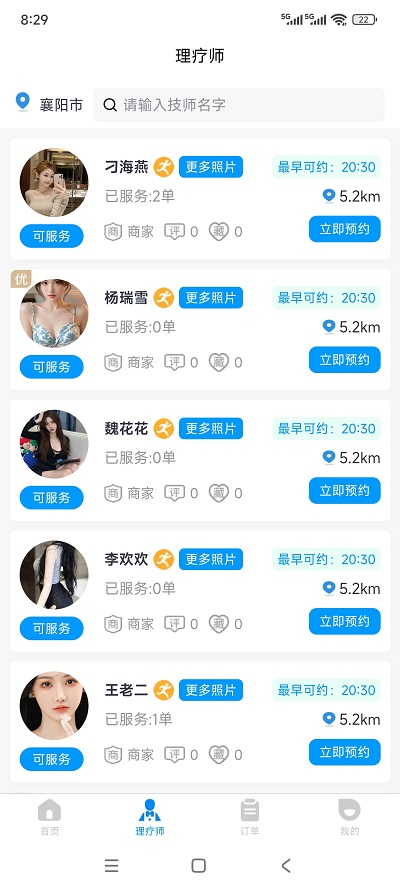
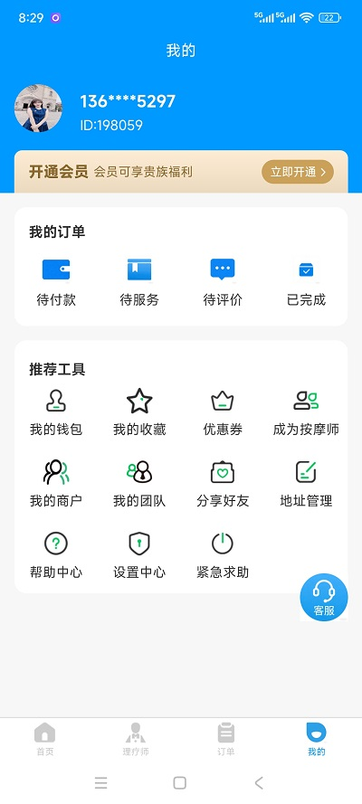
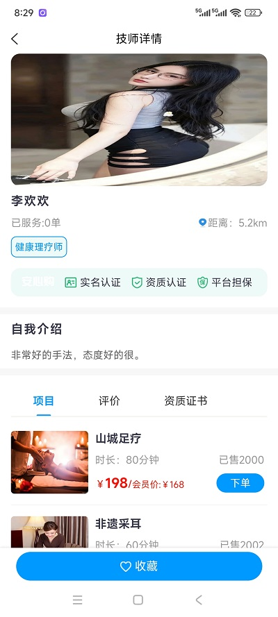
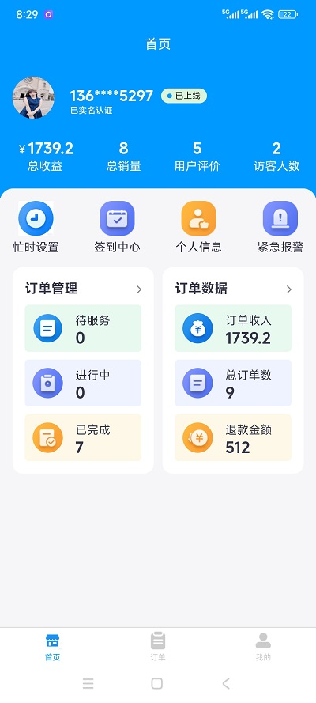
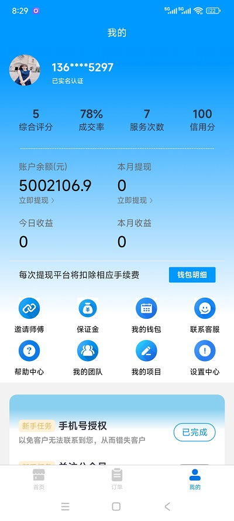

# 项目介绍

本项目是一款开源的同城上门按摩O2O服务系统，基于主流技术栈开发，面向用户、技师、平台管理员三大核心角色，打造“预约-服务-支付-评价-结算”全流程闭环服务。系统聚焦上门按摩行业痛点，解决用户预约繁琐、技师资质难把控、平台运营效率低等问题，提供安全、便捷、专业的线上服务解决方案。

项目采用三端分离架构，代码结构清晰、注释完整、部署便捷，支持二次开发和个性化定制，可直接用于区域性上门按摩平台搭建、线下理疗门店数字化转型，也可作为Java Web（或对应技术栈）学习案例，适配小型创业项目、毕业设计等多种场景。

核心定位：以“规范服务、高效运营、安全保障”为核心，打通用户、技师、平台的信息壁垒，推动上门按摩服务标准化、数字化发展。

#### 核心功能

用户端  
- 账号管理：支持手机号验证码登录、密码登录、微信/支付宝第三方登录，个人信息编辑、实名认证、隐私设置。

- 服务预约：浏览按摩项目（中式推拿、精油SPA、泰式按摩、肩颈理疗等），筛选技师（按评分、距离、技能标签），选择上门时间、地点（居家、酒店、办公），一键下单。

- 订单管理：查看订单状态（待接单、待服务、服务中、已完成、已取消），跟踪技师实时位置，申请退款、修改订单信息。

- 互动评价：服务完成后对技师进行评分、写评价，查看其他用户对技师和项目的评价，收藏心仪技师和项目。

- 优惠活动：领取、使用优惠券，参与平台满减、折扣活动，查看消费明细和余额。

- 在线沟通：与技师、平台客服实时聊天，咨询服务细节、沟通上门事宜。

2. 技师端  

- 入驻认证：提交个人信息、技能资质 ，平台审核通过后开通服务权限。

- 订单管理：接收用户订单、拒绝订单，查看订单详情（服务项目、时间、地点），导航前往服务地点，服务签到、完成确认。

- 收入管理：查看服务收入、提现记录，申请提现（绑定银行卡/微信/支付宝），查看收入明细报表。

- 个人中心：编辑技能标签、服务价格，查看个人评分和评价，设置接单时间、服务范围。

- 消息通知：接收订单提醒、平台公告、用户沟通消息，查看历史消息记录。

3. 管理员端 (Admin Side)

- 用户管理：管理所有用户账号，支持禁用、启用、删除，查看用户注册信息、消费记录、订单历史。

- 技师管理：审核技师入驻资质，管理技师账号（禁用、启用），编辑技师信息、技能标签，处理技师投诉。

- 服务管理：新增、编辑、删除按摩项目，设置项目分类、价格、服务时长，管理项目图片和描述。

- 订单管理：查看所有订单详情，处理订单投诉、退款申请，跟踪服务全过程，批量导出订单数据。

- 运营管理：发布平台公告、轮播图，创建优惠活动（优惠券、满减），管理平台配置（服务范围、手续费比例）。

- 数据统计：查看平台总用户数、技师数、订单量、交易额等核心数据，生成运营报表（日/周/月），辅助运营决策。

- 权限管理：基于RBAC权限模型，分配不同管理员角色（超级管理员、运营管理员、审核管理员），控制操作权限。

#### 技术栈

后端技术

Java + Spring Boot + Spring MVC + MyBatis-Plus 

- 核心框架：Spring Boot 2.x（简化配置，快速开发）

- 持久层：MyBatis-Plus（ORM框架，简化CRUD操作）

- 数据库：MySQL 5.7（稳定、高效，支持海量数据存储）

- 安全框架：Spring Security（权限控制、登录认证）

- 消息通知：WebSocket（实时在线沟通）

- 工具类：FastJSON（JSON解析）、Apache Commons（通用工具）、JWT（令牌认证）

前端技术

- 框架：Vue 2 + Element Plus（PC端）、UniApp（移动端，可选）

- 路由：Vue Router（页面跳转、路由守卫）

- 状态管理：Pinia（替代Vuex，轻量高效）

- 请求工具：Axios（前后端交互，拦截器处理）

- UI组件：Element Plus（PC端）、uView（移动端）

- 其他：ECharts（数据可视化）、Wangeditor（富文本编辑，用于岗位发布）

开发环境

- JDK：1.8 

- IDE：IntelliJ IDEA（后端）、WebStorm（前端）

- 数据库：MySQL 5.7

- 构建工具：Maven（后端）、npm（前端）

#### 项目示例图

 

#### 项目演示环境获取

用户端：http://spauser.xiaoxiangai.com

账户： 15810879335 
密码： 123456

技师端：http://spamaster.xiaoxiangai.com

账户：13627255297  
密码：123456

支持与交流，请添加客服，请备注来意；
 

#### 开源须知

1. 开源代码仅允许用于个人学习和研究使用。
2. 未经允许禁止将本开源代码和资源用于任何形式商业用途。
3. 需要商用请联系我们，获取商业授权。

